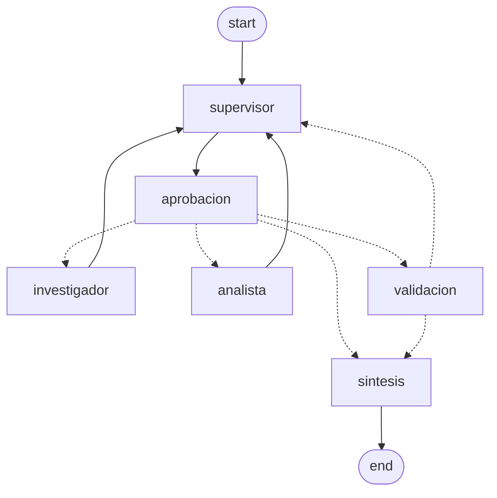

# API de producción y monitoreo activo (pre-entrega 7)

Levanté este servicio sobre el orquestador multi-agente de la pre-entrega 6. Llega una
consulta, se encola y vuelve un id al instante. Un worker la ejecuta por detrás. El estado de cada
trabajo queda en Redis y las trazas se ven en un dashboard de Phoenix.

Lo armé por lo que vimos en la unidad del módulo. Una corrida de agentes tarda entre 30 y 120
segundos, y midiendo las mías vi entre 28 y 115. Eso no puede vivir adentro de una petición HTTP: si el request se queda
esperando al equipo, cualquier timeout del camino lo corta y el servidor se queda sin recursos. Lo
resolví separando. La API recibe y encola, el worker ejecuta, y quien preguntó consulta el estado.

## Cómo se usa

Cuatro endpoints:

| Método | Ruta | Qué hace |
|---|---|---|
| POST | `/tareas` | Recibe `{"pregunta": "..."}` y devuelve 202 con el `job_id` |
| GET | `/tareas/{job_id}` | El estado del trabajo y, si terminó, la respuesta |
| POST | `/tareas/{job_id}/aprobar` | Aprueba o rechaza una tarea que quedó esperando |
| GET | `/health` | Si Redis contesta y qué modelo está configurado |

Un trabajo pasa por estos estados:

```
pendiente ─▶ en_proceso ─▶ esperando_aprobacion ─▶ aprobado ─▶ done
                      │                          │
                      └─▶ fallo                  └─▶ rechazado / rechazado_por_timeout
```

`fallo` guarda el motivo, por ejemplo un 429 del proveedor. Sin ese paso, si el agente se cae en
segundo plano el cliente queda consultando para siempre. Ese es el error que quise dejar cubierto.

## Levantarlo

Elegí Docker para el arranque rápido: ya trae Redis con los módulos de búsqueda que necesita el
checkpointer del grafo, y Phoenix listo.

```bash
cp .env.example .env         # completá GOOGLE_API_KEY, y lo de Pinecone si lo tenés
docker compose up --build
```

Queda la API en `http://localhost:8000` y el dashboard de Phoenix en `http://localhost:6006`.

Sin Docker, con Redis y Phoenix corriendo aparte:

```bash
python -m venv .venv && source .venv/bin/activate
pip install -r requirements.txt            # y requirements-dev.txt para las pruebas

export REDIS_URL=redis://127.0.0.1:6379/0
export PHOENIX_COLLECTOR_ENDPOINT=http://127.0.0.1:6006/v1/traces

PHOENIX_HOST=127.0.0.1 PHOENIX_PORT=6006 phoenix serve   # terminal 1: el dashboard
uvicorn app.main:app --host 127.0.0.1 --port 8000        # terminal 2: la API
python -m app.worker_main                                # terminal 3: el worker
```

Así lo corrí yo, con los tres procesos en tres terminales.

Un detalle que me costó un rato: `phoenix serve` no acepta `--host` ni `--port`, se configuran con
esas dos variables de entorno. Lo probé con el `--help` después de pelear media hora con un comando
que no arrancaba.

Son tres procesos a propósito. La API y el worker no comparten nada en memoria, sólo Redis. Por eso
puedo reiniciar cualquiera de los dos sin perder trabajo, y una tarea aprobada se reanuda en otro
proceso: los checkpoints del grafo quedan guardados en Redis.

## Un trabajo, paso a paso

```bash
# 1. mando la consulta: contesta en milisegundos, sin correr nada
curl -s -X POST localhost:8000/tareas -H 'content-type: application/json' \
  -d '{"pregunta":"¿Cuántos días de vacaciones corresponden a alguien con 5 años de antigüedad y qué dice la política de teletrabajo?"}'
# {"job_id":"b330e27b92f8","estado":"pendiente"}

# 2. consulto el estado (lo que haría la interfaz cada pocos segundos)
curl -s localhost:8000/tareas/b330e27b92f8
# {"job_id":"b330e27b92f8","estado":"en_proceso",...}

# 3. cuando termina, el mismo endpoint trae la respuesta
curl -s localhost:8000/tareas/b330e27b92f8
# {"estado":"done","resultado":"...","pasos":2,"contribuciones":[...]}
```

Si la consulta pide una acción con efecto, el trabajo no llega a `done` solo. Queda esperando la
aprobación con la instrucción a la vista. Esta es la salida real de una corrida mía, con la consulta
que pedía "enviar por correo el resumen":

```bash
curl -s localhost:8000/tareas/ae7a06d57526
```
```json
{"job_id":"ae7a06d57526","estado":"esperando_aprobacion",
 "pregunta":"Enviá por correo el resumen de la política de seguridad informática y decime cuántos días de vacaciones tiene alguien con 4 años de antigüedad.",
 "resultado":null,"error":null,"pasos":0,"contribuciones":[],
 "instruccion_pendiente":"Buscá la política de seguridad informática para resumirla y la política de vacaciones que detalle la cantidad de días correspondientes según los años de antigüedad, incluyendo sus fuentes.",
 "hilo_id":"b8b1b873b304",
 "creada_en":"2026-10-04T23:36:25+00:00","actualizada_en":"2026-10-04T23:36:29+00:00"}
```

Fijate que quedó en `pasos: 0`: no se ejecutó nada del equipo, la instrucción está esperando. Recién
con la aprobación sigue:

```bash
curl -s -X POST localhost:8000/tareas/ae7a06d57526/aprobar \
  -H 'content-type: application/json' -d '{"aprobado":true,"comentario":"adelante"}'
# {"job_id":"ae7a06d57526","estado":"aprobado"}

# y un rato después, el mismo GET de la consulta del estado
# {"estado":"done","pasos":2,"contribuciones":[{"agente":"investigador"},{...}]}
```

Aprobar algo que no está esperando devuelve 409 con el estado en el que está, y no un 200 mudo.
Lo probé a mano antes de escribir el test.

## La prueba de carga (5 concurrentes)

`scripts/carga.py` manda las peticiones por HTTP, como un cliente de verdad, y va consultando el
estado de cada una:

```bash
python scripts/carga.py --salida carga.json
```

La corrí el 4 de octubre contra Gemini, en dos tandas de 5 concurrentes. Antes probé si la cuota
gratuita aguantaba la ráfaga, porque me preocupaba quedarme sin llamadas en el medio: 5 concurrentes
salieron las 5 bien, entre 79,7 y 82,8 segundos, sin un solo 429.

| Tanda | Peticiones | OK | Duración total | p50 | p95 | POST más lento |
|---|---|---|---|---|---|---|
| 1 | 5 | 5 | 197,5 s | 85,4 s | 177,4 s | 0,08 s |
| 2 | 5 | 5 | 105,1 s | 46,3 s | 95,1 s | 0,039 s |

De la tabla saco dos cosas. El POST tarda milisegundos y el trabajo completo tarda decenas de
segundos. Eso es lo que buscaba al encolar en vez de ejecutar en el request. Y con 5 peticiones el
p95 es casi el máximo, así que corrí dos tandas. Con una sola, el número no dice nada.

## Qué se ve en Phoenix

Con `PHOENIX_COLLECTOR_ENDPOINT` configurado, cada nodo del grafo deja su span: el supervisor, la
búsqueda en las políticas, la calculadora, la validación y la síntesis. Las capturas que saqué de la corrida están en
`screenshots/`:

- `01-spans.png`: los spans de la corrida, con el gráfico de latencia del proyecto arriba.
- `02-traza-abierta.png`: una traza abierta: se ve el árbol (LangGraph → supervisor → aprobación →
  investigador → herramientas → modelo), y arriba a la derecha el costo y la latencia de esa traza.
- `03-latencia-costos.png`: la vista de métricas: los percentiles de latencia (p50 a p99) y el
  costo estimado en dólares de la corrida.
- `04-api-docs.png`: la API documentada y navegable que trae FastAPI (`/docs`), con los cuatro
  endpoints y los esquemas de entrada y salida.
- `05-aprobacion-humana.png`: la misma traza de la 02, con el nodo `aprobacion` seleccionado y su
  input a la vista: `{"resume": {"aprobado": true, "comentario": "ok, adelante"}}`. Es la pausa y
  la aprobación leídas del dashboard.

Dejé la instrumentación sólo sobre LangChain a propósito. Si no, Phoenix engancha también FastAPI y
cada consulta de estado del cliente deja su span. El dashboard se llena de `GET /tareas/<id>` y las
trazas del grafo quedan enterradas. Me di cuenta mirando el dashboard lleno de `GET /tareas` y ni un
solo span del supervisor.

## Lo que dice el dashboard

Miré las trazas de todas las corridas (45 ejecuciones, 115 llamadas al modelo) y las agrupé por tipo
de span. Los contenedores (`LangGraph`, `supervisor`) incluyen a sus hijos, así que sus segundos no
se suman a los de las llamadas. Sirven para ver dónde está el peso.

| Tipo de span | Veces | Latencia acumulada | Tokens |
|---|---|---|---|
| LangGraph (cada corrida completa) | 45 | 963,6 s | 0 |
| ChatGoogleGenerativeAI (llamadas al modelo) | 115 | 524,7 s | 245.761 |
| supervisor (la decisión) | 43 | 272,6 s | (incluye su llamada) |
| buscar_en_politicas_internas (la herramienta) | 26 | 102,5 s | (incluye su llamada) |
| EnsembleRetriever (la recuperación en sí) | 20 | 16,2 s | 0 |
| aprobacion | 45 | 1,0 s | 0 |
| validacion | 12 | 0,5 s | 0 |

Lo que leí ahí:

1. **La latencia está en el modelo.** De los 963 segundos acumulados, 525 se van en llamadas a
   Gemini: el 54%, con un promedio de 4,6 s y picos de 7,2 s. La recuperación híbrida tarda 0,8 s
   por consulta y la validación 0,04 s, porque las dos son código. Si tuviera que bajar el p95 no
   optimizaría el retriever. Recortaría rondas del supervisor, que es lo que multiplica las
   llamadas.
2. **Los tokens los consumen las decisiones.** El supervisor llama al modelo en cada ronda para
   elegir a quién delega. La síntesis, una vez al final. En una corrida de dos dominios son 5 o 6
   llamadas, y por eso el gasto por ejecución queda en el orden de un centavo.
3. **El nodo de aprobación no cuesta nada.** 45 pausas, 0,04 s de promedio y cero tokens: lo único
   que hace es frenar. Mientras espera la aprobación el grafo tampoco consume. En la traza de una
   corrida pausada se ve el hueco entre el último span antes de la pausa y el primero después.

La traza de una corrida que pasó por aprobación humana, en orden:

| # | Nodo | Latencia | Tokens |
|---|---|---|---|
| 1 | supervisor (decide delegar) | 4,4 s | 773 |
| 2 | aprobacion (pausa, espera permiso) | 0,0 s | 0 |
| 3 | investigador (búsqueda + redacción del aporte) | 33,6 s | 3.018 |
| 4 | supervisor (pide el cálculo) | 7,2 s | 2.417 |
| 5 | aprobacion (la tarea ya estaba aprobada) | 0,0 s | 0 |
| 6 | analista (calculadora + redacción) | 5,1 s | 2.539 |
| 7 | supervisor (cierra) | 2,0 s | 907 |
| 8 | validacion (¿la rúbrica se cumple?) | 0,0 s | 0 |
| 9 | sintesis (redacta la respuesta) | 3,4 s | 974 |

Esa corrida quedó pausada varios minutos esperando la aprobación. Por eso su traza dura mucho más que
el trabajo real del equipo: el tiempo de espera no aparece como span porque no consume nada. A mí me
sirvió para ver que el nodo que más tarda no es el que más gasta.

## El grafo



Es la topología jerárquica que ya tenía en la pre-entrega 6: el supervisor decide, los especialistas
siempre vuelven a él y no hay arista de investigador a analista. Lo que agregué acá es un nodo entre
el supervisor y el especialista: `aprobacion`.

Elegí pedir la aprobación una sola vez por trabajo, y no en cada ronda, por lo que me pasó en la
primera corrida (lo cuento abajo).

Ese nodo mira la instrucción que redactó el supervisor y el pedido original. Si aparece una acción
con efecto (publicar, escribir, enviar, borrar, contratar, firmar), o si el costo estimado del paso
pasa el umbral, pausa el grafo con `interrupt()`. La decisión se toma en código y no a criterio del
modelo, porque tiene que ser auditable y repetible. La lista de verbos y el umbral están en
`app/hitl.py` y los cubre `tests/test_hitl.py`.

La aprobación se pide una sola vez por trabajo. Cuando llega, el grafo sigue desde el checkpoint y
las rondas siguientes del supervisor ya no vuelven a preguntar. Me pasó en la primera corrida: pedía
permiso en cada ronda y no cerraba nunca. En `screenshots/05-aprobacion-humana.png` está el nodo con
el input que lo reanudó, leído del dashboard.

## Las pruebas (112, sin claves y sin red)

```bash
python -m pytest -q
........................................................................ [ 64%]
........................................                                 [100%]
112 passed in 121.02s (0:02:01)
```

Antes de dar por cerrada la entrega lo cloné en limpio y corrí la suite ahí, sin claves. Es la
prueba que me faltaba la vez pasada.
Las pruebas del orquestador usan dobles en los tres lugares donde habría red (el modelo, la nube
vectorial y el recuperador), así que corren sin ninguna clave. Las de la capa de servicio usan un
Redis en memoria con la misma interfaz.

Dejé dos cosas cubiertas por pruebas, porque me las marcaron antes:

- un test compara la cantidad de pruebas que dice este README con la que junta pytest de verdad. Si
  agrego o saco una y no actualizo el número, la suite falla;
- el estado de la cola se guarda ANTES de encolar el trabajo, y hay un test que espía el orden de
  los comandos contra Redis. Si se invirtiera, el worker podría ganar la carrera y el cliente
  recibiría un 404 que parece un bug.

## Estructura

```
app/                 lo nuevo de esta entrega
  api.py             los endpoints (no corre nada: encola y contesta)
  cola.py            el estado de los trabajos y la cola, en Redis
  worker.py          el bucle que saca de la cola y corre el grafo
  worker_main.py     `python -m app.worker_main`
  ejecutor.py        el único módulo que sabe de LangGraph
  grafo.py           el grafo de producción (el de la 6 + el nodo de aprobación)
  hitl.py            la regla de qué es crítico y cómo se vencen las aprobaciones
  observabilidad.py  la instrumentación de Phoenix
  esquemas.py        los estados y los contratos de entrada y salida
  main.py            `uvicorn app.main:app`
agents/              los dos especialistas (investigación y análisis)
data/                las políticas internas del recuperador
scripts/carga.py     las 5 peticiones concurrentes
tests/               las pruebas
screenshots/         las capturas del dashboard
```

El orquestador (`graph.py`, `nodes.py`, `supervisor.py`, `validation.py`, `tools.py`, `rag.py`,
`state.py`, `llm_factory.py`) queda igual que en la pre-entrega 6. Esta entrega no lo toca, lo
envuelve. `ingest.py` sigue siendo la única vía para cargar el índice vectorial.

## El dataset

Las políticas de `data/` son de una empresa ficticia y el texto está inventado. Es el mismo corpus
de las pre-entregas 3 y 4, con la forma y las reglas que tendría un manual de RR.HH. real. No es
información de ninguna empresa.
